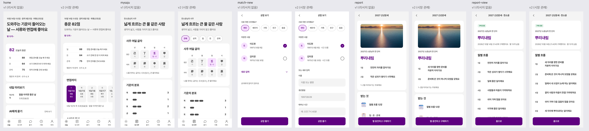

# v1(리서치 없음) → v2(시장 관례) 비교 — AI 사주앱 "결"

같은 PRD(`prd/ai-saju.md`). v2는 `market.py`(1.5초) + 해석 에이전트(약 80초)로 헬로우봇·점신·백점·우주고양이 보라·포스텔러(App Store 평점 수 상위)의 스토어 화면·리뷰 700개를 보고 관례를 뽑아 반영했다. 관례가 바꾸는 화면 5장만 다시 만들고 나머지 15장은 v1 그대로.

| 관례 | 출처 | v1 | v2 |
|---|---|---|---|
| 점수 먼저, 풀이는 아래(M2) | 헬로우봇·점신·포스텔러 | 한 줄이 점수 위 | 홈 맨 위 "총운 82점" → 한 줄 |
| 주제 칩 + 풀이 카드(M3) | 헬로우봇·포스텔러·점신 | 네 장을 길게 이어 붙임 | 전체·성격·일·돈·관계 칩 + 장별 카드 |
| 좋은 날 표시(K3, 가볍게) | 백점·포스텔러·헬로우봇 | 내일 한 줄 | "면접까지" 열흘 줄(좋음·조심은 글자로) |
| 무료 전에 광고(M6) | 4개 앱 | — | **벗어남** — 리뷰 불만 1위(15회), core(믿고 읽는 답)와 충돌 |
| 출석·복주머니 보상(K4) | 점신·포스텔러 | — | **뺌** — 누구의 성공한 순간에도 닿지 않음 |

리뷰 불만 반영: 궁합 상대 입력에 '시간 모름'(16회) · 결과가 안 나오면 별 바로 환불 + 앱 안 문의(14회) · 가격·무료 범위를 결제 전에(11회) · 월별 문장을 내 상황에 닿게(11회).

v1과 같았던 것(관례 확인만 됨): 오늘의 운세가 첫 화면(M1), 프로필·상대 저장(M4), 충전 재화(M5), 채팅형(K1), 정시 알림(K2).

