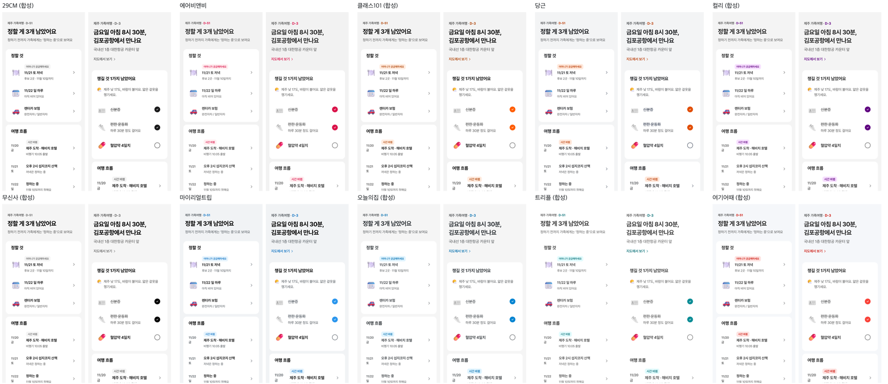

# 팔레트 라이브러리

하네스를 **빌드할 때** 미리 수집해 둔 국내 서비스 컬러 팔레트. 구동 중에는 이 목록에서 먼저 고르고, 맞는 도메인이 없을 때만 `scripts/palette_scrape.py`로 새로 수집한다.

## 수집 방법

1. `scripts/palette_scrape.py <slug> <url> --name --domain --tags` — CSS 변수의 숫자 단계 스케일(`--blue-500` 등)과 화면 요소의 실사용 색을 수집, 홈 캡처를 `/tmp/hd/palette-shots/`에 저장.
2. **브랜드 색은 사람이(빌드하는 쪽이) 캡처를 보고 확정**해 `--brand`로 넘긴다. 자동 판정(가장 많이 쓰인 유채색)은 할인 빨강·배너 색에 끌려가 절반쯤 틀렸다(마이리얼트립·무신사·클래스101·야놀자).
3. CSS 변수 스케일이 없는 사이트(대부분 — CSS-in-JS·빌드된 Tailwind)는 **측정 색으로 합성**: 회색은 실측 무채색, 브랜드 500단계는 실측 원본 그대로, 옅고 짙은 단계만 계산. 파일에 `"synthesized": true`.
4. **강조색(accent)**: 브랜드와 따로, 그 서비스가 드물게 쓰는 강조색(29CM 할인율 주황처럼)이 있으면 `"accent": {"scale", "step", "seen"}`으로 적는다 — `seen`은 그 서비스가 어디에 쓰는지. 실사용 빈도로 고르는 수집으로는 잡히지 않으니 디자인 시스템 CSS 변수(`accent`·`point`·`highlight` 이름)나 캡처에서 사람이 확인한다. `derive.py`는 이것을 `--c-accent`(점, 3:1)·`--c-accent-text`(글자, 4.5:1)로만 내고 공용 부품은 쓰지 않는다 — 쓰는 법은 `COMPONENTS.md`의 "강조색".
5. `derive.py --palette`가 역할 색을 고를 때 팔레트에 중간 회색이 비면(합성 팔레트) 먹색·배경 사이에서 보조(7.5:1)·옅은 글자(4.8:1)를 계산한다.

## 목록 (10곳, 2026-10-01)

- **29CM** (`29cm`) — 커머스·패션 · 모노, 에디토리얼 · 브랜드 `#19191a` · 측정 합성 · 모노 · 강조 `#ff4800`(할인율, ruler 변수)
- **에어비앤비** (`airbnb`) — 여행·숙소 · 따뜻함, 감성 · 브랜드 `#da1249` · CSS 변수
- **클래스101** (`class101`) — 교육·취미 · 활기, 친근 · 브랜드 `#ff5d00` · 측정 합성
- **당근** (`daangn`) — 지역·생활 · 따뜻함, 친근 · 브랜드 `#ff6600` · CSS 변수
- **컬리** (`kurly`) — 커머스·식품 · 고급, 차분 · 브랜드 `#5f0080` · 측정 합성
- **무신사** (`musinsa`) — 커머스·패션 · 모노, 강렬 · 브랜드 `#000000` · 측정 합성 · 모노
- **마이리얼트립** (`myrealtrip`) — 여행 · 밝음, 여행, 신뢰 · 브랜드 `#2b96ed` · CSS 변수
- **오늘의집** (`ohouse`) — 생활·인테리어 · 산뜻, 생활 · 브랜드 `#00a1ff` · 측정 합성
- **트리플** (`triple`) — 여행 · 산뜻, 여행 · 브랜드 `#0ecedb` · 측정 합성
- **여기어때** (`yeogi`) — 여행·숙소 · 선명, 활기 · 브랜드 `#f94239` · 측정 합성

미수집: 야놀자(NOL 리브랜딩 후 브랜드 색 판정 불가), 배달의민족(첫 화면이 이미지 위주), 캐치테이블(팝업 오버레이), 토스(첫 화면이 사진뿐).

## 주의

목업·시안 단계의 참고용이다. 출시할 서비스에 다른 브랜드 팔레트를 그대로 쓰면 브랜드 혼동 소지가 있으니, 결과물에 "색 출처: ○○ 팔레트"를 표기한다.

